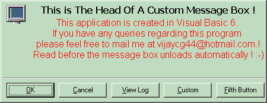



## Extended Custom Message Box

### Description

----

Default button bug fixed

----

This is a custom message box generator.It provides the following

functionalities that are not provided by the MsgBox function in VB.

1.Allows you to change the font of the message.

2.Allows you to change the font color of the message.

3.Allows you to set italic font for the message.

4.Allows you to set bold font for the message.

5.Allows you to change the caption of the buttons.

6.You can have as many buttons as you want on the message box.

7.The Message box has a totally new border style.

8.You can also set the AutoUnloadTime so that the MessageBox will automatically terminate when the specified time had elapsed returning the first button value.

9.The MessageBoxEx function used to create the messagebox returns the number of button pressed starting from zero.

10.Use the AddButton method to add as many buttons as you like. (Max 255 i think this is more than enough.)
 
### More Info
 
Returns the index of the button clicked.

             |
---                |---
**Submitted On**   |2002-04-05 15:13:06
**By**             |[Vijay Phulwadhawa](https://github.com/Planet-Source-Code/PSCIndex/blob/master/ByAuthor/vijay-phulwadhawa.md)
**Level**          |Advanced
**User Rating**    |4.8 (24 globes from 5 users)
**Compatibility**  |VB 5\.0, VB 6\.0
**Category**       |[Custom Controls/ Forms/  Menus](https://github.com/Planet-Source-Code/PSCIndex/blob/master/ByCategory/custom-controls-forms-menus__1-4.md)
**World**          |[Visual Basic](https://github.com/Planet-Source-Code/PSCIndex/blob/master/ByWorld/visual-basic.md)
**Archive File**   |[Extended\_C68955452002\.zip](https://github.com/Planet-Source-Code/vijay-phulwadhawa-extended-custom-message-box__1-26595/archive/master.zip)

